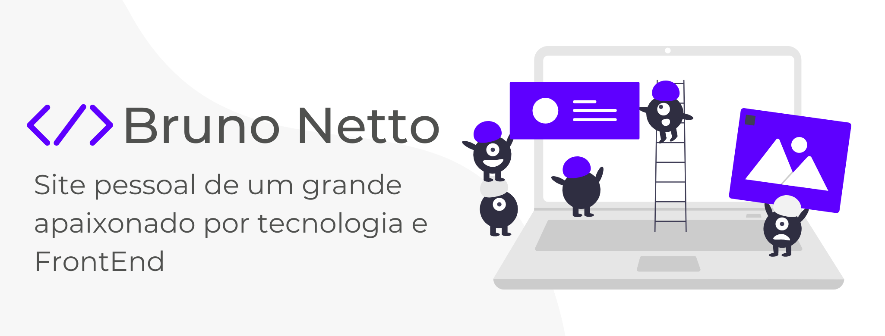
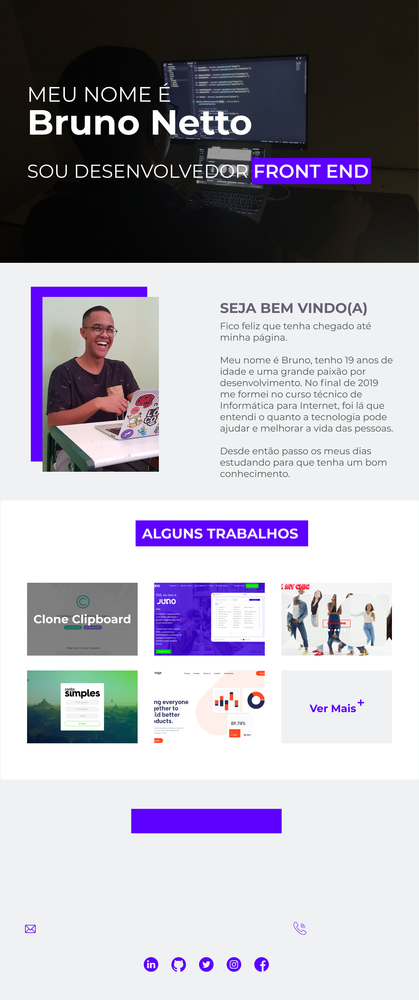
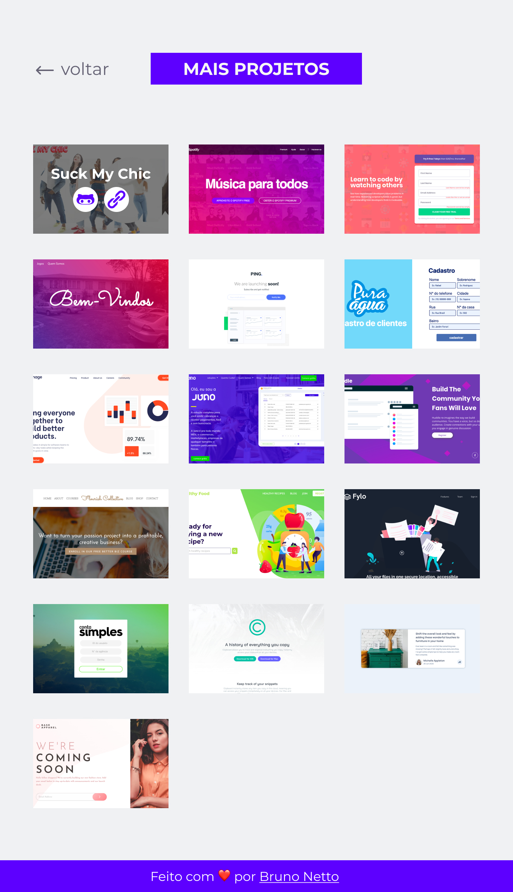

	

<h1 align="center">Portfólio Bruno Netto(DEPRECATED)</h1>

Página para mostrar os principais projetos desenvolvidos por mim, e todas as formas para entrar em contato comigo. Fique à vontade para ver tudo o que tenho para mostrar😁

 
<h4 align="center"> 
	🚧 Projeto em construção...  🚧
</h4>
 

<h2>💻 Sobre o Projeto</h2>

Fiz essa página com o intuito de mostrar as coisas que estava fazendo durante meus estudos. Todos os projetos que ia fazendo ficavam apenas no meu computador, e minha ideia era que de alguma forma outras pessoas pudessem ver, e até mesmo para que eu conseguisse analisar minha evolução no decorrer do desenvolvimento de cada novo projeto.
	
 

<h2>✅ Features</h2>

- [x] Página principal
- [x] Página de projetos
- [ ] Páginas responsivas
- [ ] Formulário para contato

 

<h2>🛠 Tecnologias</h2>

- HTML
- CSS

 

<h2>🎨 Layout</h2>

O Layout do projeto está no <a href="https://www.figma.com/file/Ylihqa6IvLRK1wYw1X1Y0P/Novo-Portf%C3%B3lio?node-id=2%3A60">Figma</a>:

	
	

<h2>Autor</h2>
---

<a href="https://www.linkedin.com/in/bruno-netto-77434b187/">
 
  
 <b>Bruno Netto</b></a> <a href="https://www.linkedin.com/in/bruno-netto-77434b187/" title="Linkedin">🚀</a>

Feito com ❤️ por Bruno Netto. Entre em contato!
